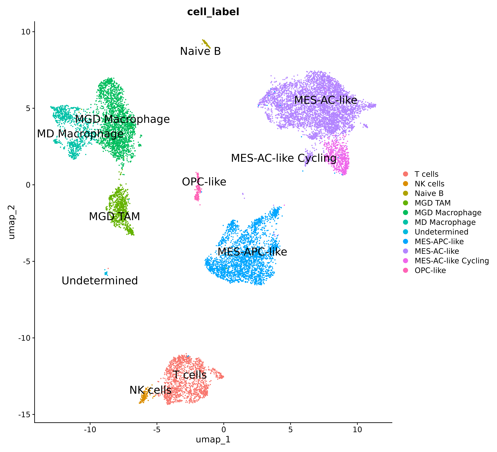
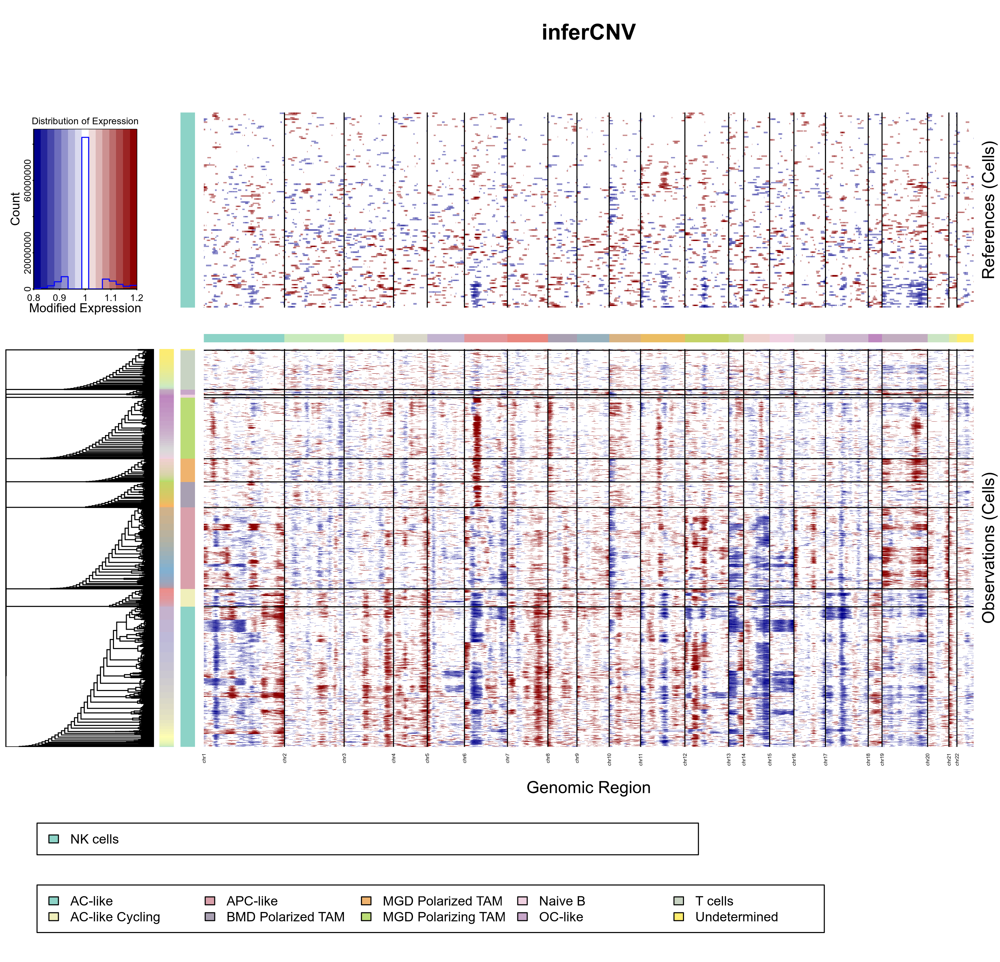
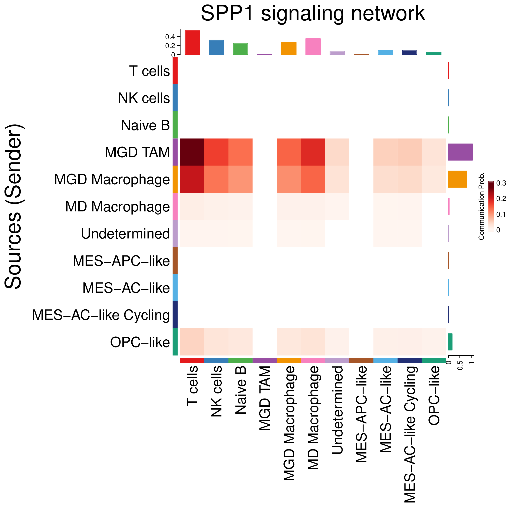
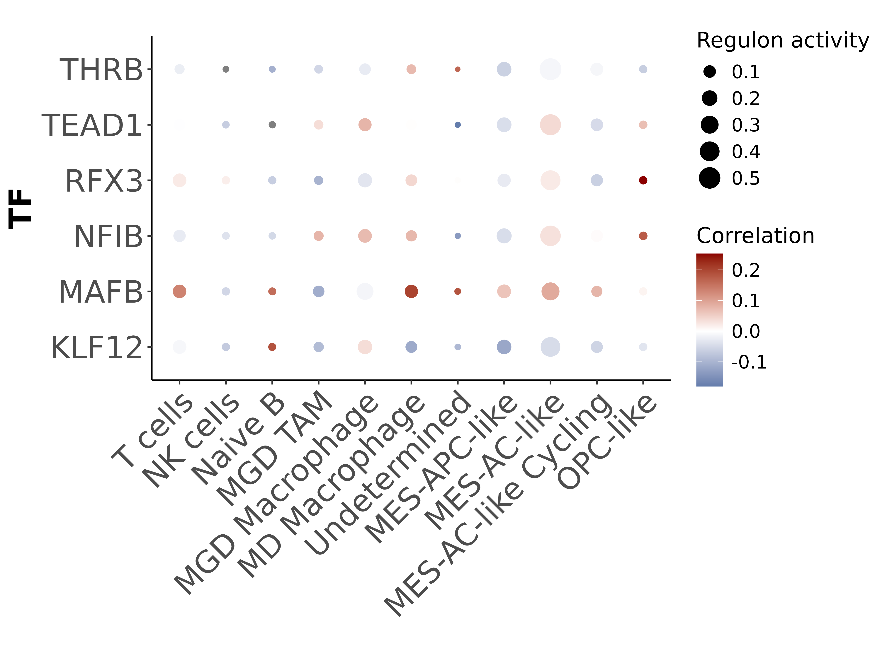
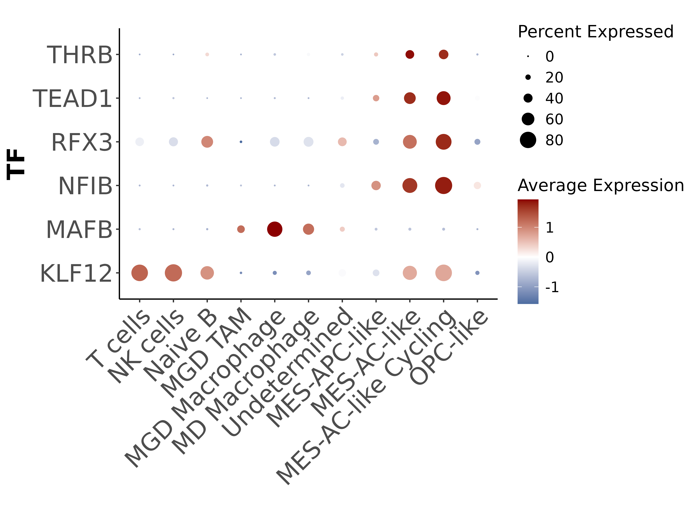
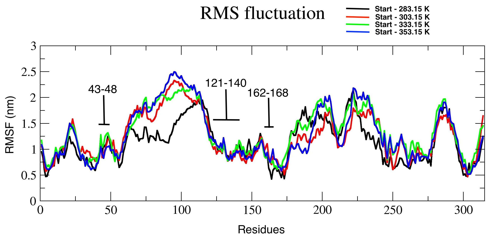
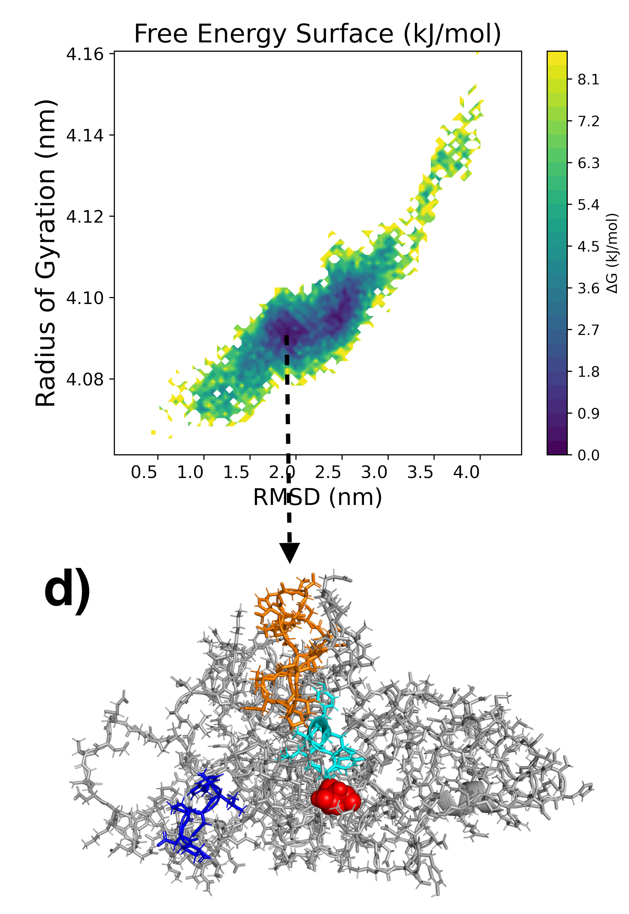
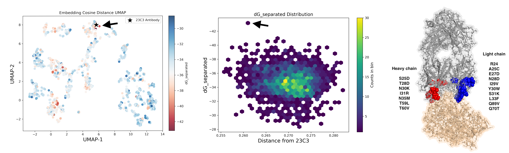
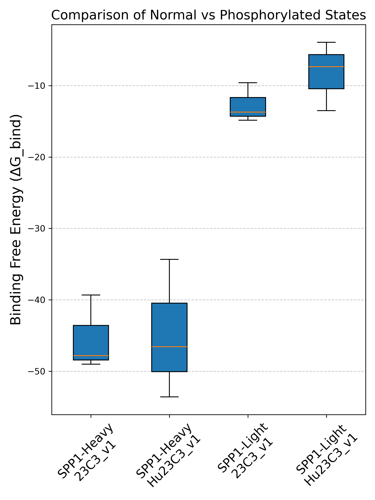

# Project long-term goal:
1. Collect and process publicly available single cell, bulk transcriptomic, and structural bioinformatics data to explore, organize, and annotate key pathways and cytokines associated with immune suppression in Pediatric High Grade Glioma (pHGG). 
2. Create a database of small molecules that may cross blood-brain barrier and help target certain cytokine-receptor pairs.
3. Apply directed evolution of antibodies to effectively target cytokines of interest and minimize off-target hits. 

Given the high mortality rate of pHGG, multiple labs around the world are making their transcriptomic data available for everyone to use and explore. Us bioinformatician's can organize and annotate these datasets in a way that can help wet lab and clinical researchers to easily explore their hypothesis without worrying too much about programming or tool usage limitations. Feel free to reach out to us is you find this project interesting, and if you would want to contribute. This is a complete open source project with all code, results, and datasets freely available to public.   

## Project 1: Targeting the SPP1-CD44 Axis in Pediatric High-Grade Glioma through Integrated Single-Cell and Structural Bioinformatics 

### <b>Manuscript under review</b> 
- [Manuscript draft link: For Nationwide Children's Hospital employees](https://nationwidechildrens-my.sharepoint.com/:w:/r/personal/ambuj_kumar_nationwidechildrens_org/Documents/SPP1_Project/Manuscript.docx?d=w6709113cea954b4794edb8017e88f115&csf=1&web=1&e=Fe9XyH) 

### Authors
- Shiwani Limbu, University of California Merced 
- Ambuj Kumar, Nationwide Children's Hospital


## Scripts and workflows
1. <b>Collect and clean pHGG single cell data</b> - Here we collect single cell data from public database and preprocess it for our specific study.   
   - 1.1. <i><b>Single cell data collection</b></i> - [Notebook](/Notebook/Step1_Dataset/pull_dataset.ipynb)
   - 1.2. <i><b>Create seurat object</b></i> - [Notebook](/Notebook/Step2_Generate_Seurat_Object/create_seurat.ipynb)
   - 1.3. <i><b>Doublet finder</b></i> - [Notebook](/Notebook/Step3_Preprocessing/doublet_finder.ipynb) 
   - 1.4. <i><b>Preprocessing</b></i> - [Notebook](/Notebook/Step3_Preprocessing/filter_cells.ipynb)

2. <b>Identify cell types present in pHGG single cell data</b> - Here, multiple clean preprocessed sample data is then integrated, clustered, annotated to identify various tumor and immune cell types present within it. 
   - 2.1. <i><b>Harmony Integration</b></i> - [Notebook](/Notebook/Step4_Integration/harmony_integration.ipynb)
   - 2.2. <i><b>Clustering and cell annotation</b></i> - [Notebook](/Notebook/Step5_Clustering/clustering.ipynb)
   

   - 2.3. <i><b>InferCNV</i></b> - [Notebook](/Notebook/Step6_Infercnv/infercnv.ipynb) 
   

   - 2.4. <i><b>Gene Set Enrichment Analysis</b></i> - [Notebook](/Notebook/Step5_Clustering/clustering.ipynb)
   

      - 2.4.1. <b>Immune cells</b> 

         - 2.4.1.1. <i><b>T cells</b></i> show strong signatures for T cell receptor complex, MHC class II protein complex, and immunological synapse. NK cells are uniquely enriched in cytotoxic granule lumen, perforin complex, and natural killer cell–mediated cytotoxicity pathways, consistent with their tumor‐killing potential.  

         - 2.4.1.2. <i><b>Homeostatic/transitioning macrophages</b></i> - Summary: These Macrophages are setting up their secretory functions to modulate the immune microenvironment—either in support or suppression of immune cells, which indicates that these cells are in highly plastic state, typical of macrophages in transition. 
            - Tertiary granule membrane, Azurophil granule membrane - Suggests mobilization and trafficking of immune granules, which may indicate that large number of macrophage cells have transitioned into M2 Macrophage. 
            - Golgi stack, golgi cisterna membrane, golgi apparatus subcompartment - Indicating high protein processing, which is essential during transition phase. 
            - Ficolin-1 Rich Granule Membrane - Ficolins are PRRs (pattern recognition receptors) involved in lectin pathway complement activation, which has a dual role in cancer. Its activation can lead to downstream pathway activation either resulting in the generation of C3a and C5a anaphylatoxins, which can suppress immune cells and promote tumor progression, or the formation of the membrane attack complex (MAC), which can directly lyse cancer cells.

         - 2.4.1.3. <i><b>Microglia-derived TAMs</b></i> - Summary: Enriched pathway indicate following properties - Highly metabolically and translationally active, antigen presentation, actively remodeling their local environment via secretion and phagocytosis (key to cell-cell communication).
            - Ribosome subunit, cytosolic ribosome, large/small subunit pathways - indicating high protein synthesis activity, which is often seen in activated or metabolically active cells. This suggests that the MGD TAMs are actively producing proteins, possibly for cytokine secretion, antigen presentation, or immune modulation. They are definitly active and not in a quiescent state.
            - Primary lysosome, lytic vacuole pathways - Indicates active processes like autophagy, endocytosis, and phagocytosis, which are all important for maintaining cellular homeostasis and responding to various stimuli within the tumor microenvironment.
            - MHC class II protein complex - Classic marker of professional antigen-presenting cells (APCs). These TAMs may be presenting antigens to CD4⁺ T cells, which indicates presence of CD4⁺ T cells in the TME.
 
      - 2.4.2. <b>Tumor cells</b> -
         - 2.4.2.1. <i><b>MES-APC-like cells</b></i> - Summary: Invasive, undergoing transition from APC to MES cell type. 
            - Combined enrichment of mitochondrial inner membrane, mitochondrial envelope, intermembrane space, membrane, NADH dehydrogenase, respiratory chain complex I, Proton transporting ATP synthase complex, Cytochrome complex, oxidoreductase complex indicates that these MES-like cells are undergoing high oxidative phosphorylation (OXPHOS) to meet elevated energy demands to meet likely high more invasive characteristics, which is common in glioblastoma. 
            - These pathway - Ribosome, mitochondrial ribosome, ribonucleoprotein complex, rough endoplasmic reticulum, peptidase complex, peribosome, Nucleolus and small subunit processome are collectively a translation powerhouse of cells, suggesting that these MES-like cells are producing large amounts of protein, to meet the resources required for their high invasive and proliferative behavior.
            - Activation of the above pathways is further supported by the activation of U2 type spliceosomal complex, U12 type spliceosomal complex, spliceosomal snRNP complex, pre-catalytic spliceosome, U4/U6.U5 tri-snRNP complex, small nuclear ribonucleoprotein complex, and Sm-like protein family complex which are associated with high level of RNA processing and alternative splicing. These MES-cells are likely fine-tuning gene expression by inducing alternate splicing events. This raises a question of how much does alternate splicing control cell type transition these glioma's primarily via alternate splicing mechinery, which could make it a strong target. 

         - 2.4.2.2. <i><b>MES-AC-like</b></i> - This is one of the most intriguing cell types we have among all. This cluster does not express any classical neuron or neuron progenitor cell markers, and clearly expresses both MES-like and AC-like cell type markers. Although, it does express multiple canonical neuronal pathways. This indicates that these transitioning cells are likely partially acquiring neuronal mimicry.

         - 2.4.2.3. <i><b>MES-AC-like cyclcing</b></i>
            - Condensed chromosome, spindle, spindle pole, mitotic spindle, spindle midzone, kinetochore, centromere, replication fork, midbody, cleavage furrow, centriole - all are hallmarks of active mitosis, indicating that these cells are actively dividing and we caught them mid-cycle — probably in S/G2/M phases.
            - Activation of kinesin complex, microtubule cytoskeleton, supramolecular fiber, microtubule organizing center are associated with chromosome segregation and cytokinesis during cell division. 
            - Activation of nuclear chromosome, nuclear replication fork, heterochromatin, DNA repair complex indicates S-phase DNA replication activity and DNA damage sensing/repair, common in rapidly proliferating cells under stress, such as tumor cells.


3. <b>Identify SPP1 cytokine activity and its regulatory features in pHGG.</b> This step enables us to identify active immunosupressive cytokine-receptor signals in pHGG, and transcription factors that may likely regulate it. Identifying these TFs can help us design specific antibody or small molecules to inhibit it.
   - 3.1. <i><b>Cellchat cell-cell communication</b></i> - [Notebook](Notebook/Step7_Cellchat/run_cellchat.ipynb): Clearly showing that TAM SPP1 to T cell CD44 signalling is active in pHGG. 
   

   - 3.2. <i><b>Pyscenic transcription factor prediction</b></i> - [Notebook](Notebook/Step8_Pyscenic/pyscenic_plots.ipynb): Here, in the first image, dot size shows predicted SPP1 TFs Regulon Specificity Score (RSS) across all cell types, and the color represents TF expression spearman correlation with SPP1 expression in the corresponding cell type. In second image, size of the dot represents percentage of cells expressing corresponding TF gene expression within a given cell type and color represents average gene expression. Combining these two images, we can easily conclude that no single TF can be assigned as a primary regulator of SPP1 gene expression in TAMs.
   <p align="center">
      
      
   </p>

4. <b>Build antibody to target SPP1</b> - Here we aim to build an antibody that can specifically target CD44 binding motif of SPP1 cytokine. 

   - 4.1. <i><b>Replica Exchange Molecular dynamics simulation</b></i> - Here, first we will induce multiple temperature jump shocks to SPP1 protein structure to test the relative stability of this disordered protein. We know that residue 43-48 and 162-168 has been used for antibody targeting. We need to compare fluctuation of SPP1 CD44 binding region (residue 121-140) with 43-48 and 162-168 to check if the fluctuation of 121-140 has a comparable fluctuation profile to consider it for antibody targeting. Root mean squared fluctuation (RMSF) results across multiple temperature trajectories shows comparable RMSF profile of resi 121-140 to resi 43-48 and 162-168.
      - [Notebook](Notebook/Step9_SPP1_Molecular_Dynamics/simulate.ipynb)
      - [Slurm automation script](Notebook/Step9_SPP1_Molecular_Dynamics/src/simulation_sbatch_script.sh) 
      

      - Most stable and dominant conformation across all 4 trajectories were picked for downstream analysis.
      

   - 4.2. <i><b>Rosetta antibody design (23C3-v1)</b></i> - Build an antibody to target CD44 binding region of SPP1 protein.
      - Lets first identify CDR regions in murine 23C3 antibody using PyIgClassify2. Below are the list predicted CDRs,
      ```plaintext
      | Chain          | CDR region | Residue     |
      |----------------|------------|-------------|
      | Heavy chain    |    H1      |   23-35     |
      | Heavy chain    |    H2      |   50-62     |
      | Heavy chain    |    H3      |   99-105    |
      | Heavy chain    |    H4      |   74-81     |
      | Light chain    |    L1      |   24-34     |
      | Light chain    |    L2      |   49-53     |
      | Light chain    |    L3      |   89-97     |
      | Light chain    |    L4      |   66-71     |
      ```
      - Here, 2500 antibody variants of murine anti-SPP1 antibody 23C3 was generated using Rosetta antibody modelling workflow. Top hit variant was picked using top binding affinity with SPP1 and least sequence divergence from 23C3. We will be denoting it as 23C3-v1 from hereon. 
      - [Rosetta script](Notebook/Step11_Antibody_Design/src/antibody_design.sh)
      - [esm2 embedding based AB variant selection](Notebook/Step11_Antibody_Design/esm_embedding_workflow.ipynb)
      - 23C3-v1 binding energy and sequency divergence profile, as well as its mutations as compared to murine 23C3 antibody is shown below. 
      

   - 4.3. <i><b>Humanization of 23C3-v1 (Hu23C3-v1)</b></i> - [Notebook](Notebook/Step11_Antibody_Design/humanize_epitope.ipynb) - Modify 23C3-v1 class I and class II epitope region amino acid sequences in 23C3-v1 to minimize immune response against it. This step requires careful selection of point mutations to eliminate epitope hits, specifically on the surface exposed regions on the protein, without loosing its SPP1 binding affinity. Below are the steps outline implemented in this study.  
      - 4.3.1. Pull class I and class II epitopes in 23C3-v1
      - 4.3.2. Select epitope regions that are exposed on antibody surface with <b>SASA >= 50%</b>
      - 4.3.3. Compare epitope regions of 23C3-v1 with other closely related humanized antibodies
      - 4.3.4. Incorporate relevant point mutations in epitopes found in CDR regions (if any) to neutralize it without loosing SPP1 binding.
      - 4.3.5. Incorporate replace 23C3-v1 residues with corresponding alignment position residue of humanized AB in non-CDR epitope regions.
      - 4.3.6. Test the modified 23C3-v1 binding affinity changes with SPP1 using molecular dynamics. 
      - Below are the list of predicted epitope residues with SASA >= 50% in heavy and light chain of 23C3-v1.
      ```plaintext
      | Antibody Chain   | Allele class | Residue     |    Peptide        |  % Surface Exposed |
      |------------------|--------------|-------------|-------------------|--------------------|
      | Heavy chain      |    II        |   56-70     |  NNYTTYYADSVKDRF  |        60.00       |
      | Heavy chain      |    I         |  172-180    |  VLQSDLYTL        |        55.55       |
      | Light chain      |    II        |  146-160    |  VKWKIDGAERGNGVL  |        60.00       |
      ```
 
   - 4.4. <i><b>Hu23C3-v1-SPP1 binding affinity test</b></i> - Lets check if we significantly loose SPP1 binding affinity upon humanization of 23C3-v1 
      - [MD simulation of Hu23C3-v1 docked with SPP1 and 23C3-v1 docked with SPP1](Notebook/Step12_Antibody_Molecular_Dynamics/simulate.ipynb)
      - [Binding affinity test](Notebook/Step13_Binding_Affinity_MMPBSA/mmpbsa.sh)
      - Binding affinity results across all three independent trajectories indicate no significant change in binding affinity of Hu23C3-v1 with SPP1 as compared to 23C3-v1.
      

5. <b>Utility scripts<b> - [dir](Notebook/Utility)


<hr>

# Other resources
## 1. Molecules capable of passing through blood brain barrier
- Manuscript - [https://www.nature.com/articles/s41597-021-01069-5](https://www.nature.com/articles/s41597-021-01069-5)
- Github - [https://github.com/theochem/B3DB/tree/main](https://github.com/theochem/B3DB/tree/main)