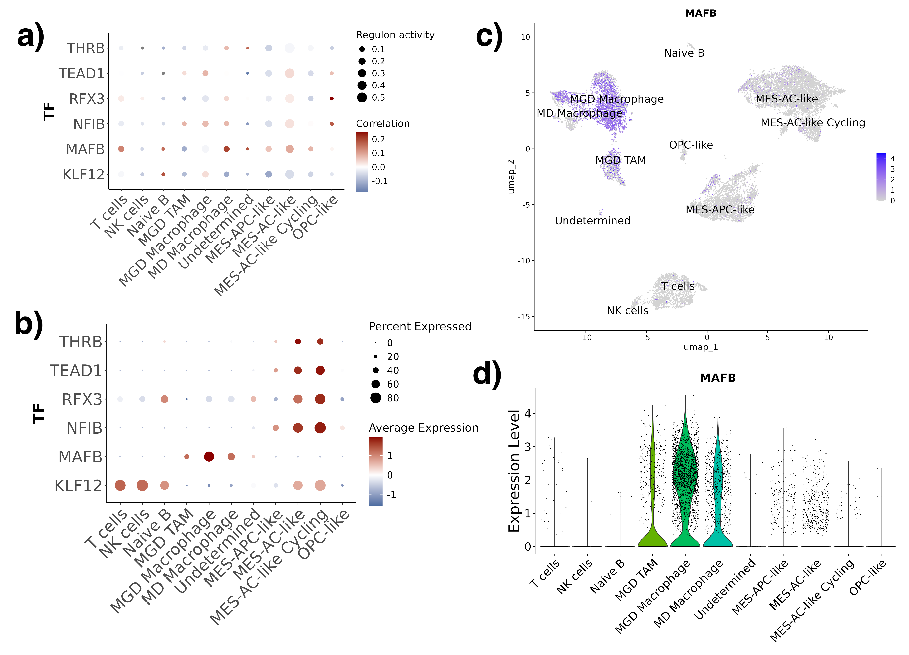
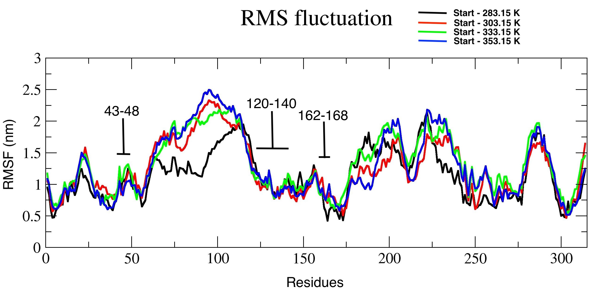
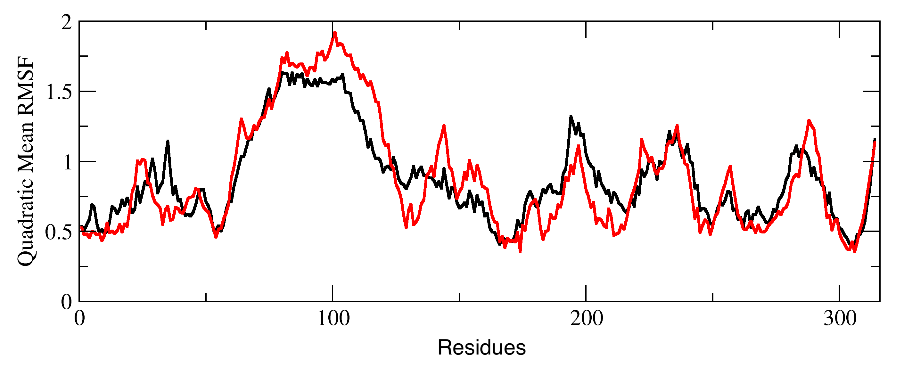
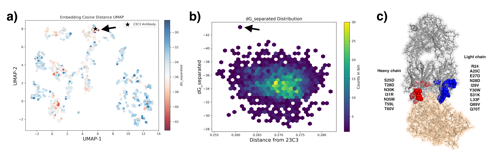

# Project long-term goal:
- 1. Collect and process publicly available single cell, bulk transcriptomic, and structural bioinformatics data to explore, organize, and annotate key pathways and cytokines associated with immune suppression in Pediatric High Grade Glioma (pHGG). 
- 2. Create a database of small molecules that may cross blood-brain barrier and help target certain cytokine-receptor pairs.
- 3. Apply directed evolution of antibodies to effectively target cytokines of interest and minimize off-target hits. 

Given the high mortality rate of pHGG, multiple labs around the world are making their transcriptomic data available for everyone to use and explore. Us bioinformatician's can organize and annotate these datasets in a way that can help wet lab and clinical researchers to easily explore their hypothesis without worrying too much about programming or tool usage limitations. Feel free to reach out to us is you find this project interesting, and if you would want to contribute. This is a complete open source project with all code, results, and datasets freely available to public.   

## Project 1: Targeting the SPP1-CD44 Axis in Pediatric High-Grade Glioma through Integrated Single-Cell and Structural Bioinformatics 

### <b>Manuscript under review</b> 
- [Manuscript draft link: For Nationwide Children's Hospital employees](https://nationwidechildrens-my.sharepoint.com/:w:/r/personal/ambuj_kumar_nationwidechildrens_org/Documents/SPP1_Project/Manuscript.docx?d=w536bef566c474ab9b5c1bbe746b12022&csf=1&web=1&e=OKO4T6) 

### Authors
- Shiwani Limbu, University of California Merced & University of Kansas Medical Center 
- Ambuj Kumar, Nationwide Children's Hospital

## Scripts and workflows
- 1. Single cell data collection - [Notebook](/Notebook/Step1_Dataset/pull_dataset.ipynb)
- 2. Create seurat object - [Notebook](/Notebook/Step2_Generate_Seurat_Object/create_seurat.ipynb)
- 3. Doublet finder - [Notebook](/Notebook/Step3_Preprocessing/doublet_finder.ipynb) 
- 4. Preprocessing - [Notebook](/Notebook/Step3_Preprocessing/filter_cells.ipynb)
- 5. Harmony Integration - [Notebook](/Notebook/Step4_Integration/harmony_integration.ipynb)
- 6. Clustering and cell annotation - [Notebook](/Notebook/Step5_Clustering/clustering.ipynb)
- 7. InferCNV - [Notebook](/Notebook/Step6_Infercnv/infercnv.ipynb) 
- 8. Cellchat cell-cell communication - [Notebook](Notebook/Step7_Cellchat/run_cellchat.ipynb)
- 9. Pyscenic transcription factor prediction - [Notebook](Notebook/Step8_Pyscenic/pyscenic_plots.ipynb)
- 10. Molecular dynamics simulation - [Notebook](Notebook/Step9_SPP1_Molecular_Dynamics/simulate.ipynb), [Slurm automation script](Notebook/Step9_SPP1_Molecular_Dynamics/src/simulation_sbatch_script.sh) 
- 11. Rosetta antibody design - [Rosetta script](Notebook/Step11_Antibody_Design/src/antibody_design.sh), [esm2 embedding based AB variant selection](Notebook/Step11_Antibody_Design/esm_embedding_workflow.ipynb)
- 12. Utility scripts - [dir](Notebook/Utility)

## Results

### Fig 1. 
- a) Unsupervised clustering and UMAP projection identified ten major cell populations, including malignant glial‐lineage states (MES-like, MES-AC-like, MES-AC-like Cycling, MES-APC-like, OPC-like), lymphoid cells (T cells, NK cells, Naïve B), and myeloid cells segregating into two macrophage subsets (MGD Macrophage, MGD TAM) plus a Microglia‐derived TAM cluster (MD Macrophage). A small “Undetermined” cluster likely represents rare stromal elements.

- b) Infercnv results
InferCNV was applied to detect large-scale chromosomal copy‐number alterations at single‐cell resolution, using T cells, NK cells, and Naïve B cells as a diploid reference. The resulting CNV heatmap (Fig. 1b) revealed that all malignant glial clusters display characteristic aberration-such as chromosome 7 gain, as well as chromosome 1, 6, and 13 loss - while immune clusters show flat profiles consistent with a normal karyotype. 

- c) Marker dotplot
Cell type marker expression dotplot. 

- d) GSEA normalized enrichment score dotplot

   - d-1) Immune cells - 

      - d-1.2) T cells show strong signatures for T cell receptor complex, MHC class II protein complex, and immunological synapse. NK cells are uniquely enriched in cytotoxic granule lumen, perforin complex, and natural killer cell–mediated cytotoxicity pathways, consistent with their tumor‐killing potential.  

      - d-1.4) Homeostatic/transitioning macrophages - Summary: These Macrophages are setting up their secretory functions to modulate the immune microenvironment—either in support or suppression of immune cells, which indicates that these cells are in highly plastic state, typical of macrophages in transition. 

         - d-1,4.1) Tertiary granule membrane, Azurophil granule membrane - Suggests mobilization and trafficking of immune granules, which may indicate that large number of macrophage cells have transitioned into M2 Macrophage. 
         - d-1.4.2) Golgi stack, golgi cisterna membrane, golgi apparatus subcompartment - Indicating high protein processing, which is essential during transition phase. 
         - d-1-4.3) Ficolin-1 Rich Granule Membrane - Ficolins are PRRs (pattern recognition receptors) involved in lectin pathway complement activation, which has a dual role in cancer. Its activation can lead to downstream pathway activation either resulting in the generation of C3a and C5a anaphylatoxins, which can suppress immune cells and promote tumor progression, or the formation of the membrane attack complex (MAC), which can directly lyse cancer cells.

      - d-1.5) Microglia-derived TAMs - Summary: Enriched pathway indicate following properties - Highly metabolically and translationally active, antigen presentation, actively remodeling their local environment via secretion and phagocytosis (key to cell-cell communication).

         - d-1.5.1) Ribosome subunit, cytosolic ribosome, large/small subunit pathways - indicating high protein synthesis activity, which is often seen in activated or metabolically active cells. This suggests that the MGD TAMs are actively producing proteins, possibly for cytokine secretion, antigen presentation, or immune modulation. They are definitly active and not in a quiescent state.
         - d.1.5.2) Primary lysosome, lytic vacuole pathways - Indicates active processes like autophagy, endocytosis, and phagocytosis, which are all important for maintaining cellular homeostasis and responding to various stimuli within the tumor microenvironment.
         - d.1.5.3) MHC class II protein complex - Classic marker of professional antigen-presenting cells (APCs). These TAMs may be presenting antigens to CD4⁺ T cells, which indicates presence of CD4⁺ T cells in the TME.
 
   - d-2) Tumor cells
      - d-2.1) MES-APC-like cells - Summary: Invasive, undergoing transition from APC to MES cell type. 
         - d-2.1.1) Combined enrichment of mitochondrial inner membrane, mitochondrial envelope, intermembrane space, membrane, NADH dehydrogenase, respiratory chain complex I, Proton transporting ATP synthase complex, Cytochrome complex, oxidoreductase complex indicates that these MES-like cells are undergoing high oxidative phosphorylation (OXPHOS) to meet elevated energy demands to meet likely high more invasive characteristics, which is common in glioblastoma. 
         - d-2.1.2) These pathway - Ribosome, mitochondrial ribosome, ribonucleoprotein complex, rough endoplasmic reticulum, peptidase complex, peribosome, Nucleolus and small subunit processome are collectively a translation powerhouse of cells, suggesting that these MES-like cells are producing large amounts of protein, to meet the resources required for their high invasive and proliferative behavior.
         - d-2.1.3) Activation of the above pathways is further supported by the activation of U2 type spliceosomal complex, U12 type spliceosomal complex, spliceosomal snRNP complex, pre-catalytic spliceosome, U4/U6.U5 tri-snRNP complex, small nuclear ribonucleoprotein complex, and Sm-like protein family complex which are associated with high level of RNA processing and alternative splicing. These MES-cells are likely fine-tuning gene expression by inducing alternate splicing events. This raises a question of how much does alternate splicing control cell type transition these glioma's primarily via alternate splicing mechinery, which could make it a strong target. 

      - d-2.2) MES-AC-like: This is one of the most intriguing cell types we have among all. This cluster does not express any classical neuron or neuron progenitor cell markers, and clearly expresses both MES-like and AC-like cell type markers. Although, it does express multiple canonical neuronal pathways. This indicates that these transitioning cells are likely partially acquiring neuronal mimicry.

      - d-2.3) MES-AC-like cyclcing: 
         - d-2.3.1) Condensed chromosome, spindle, spindle pole, mitotic spindle, spindle midzone, kinetochore, centromere, replication fork, midbody, cleavage furrow, centriole - all are hallmarks of active mitosis, indicating that these cells are actively dividing and we caught them mid-cycle — probably in S/G2/M phases.
         - d-2.3.2) Activation of kinesin complex, microtubule cytoskeleton, supramolecular fiber, microtubule organizing center are associated with chromosome segregation and cytokinesis during cell division. 
         - d-2.3.3) Activation of nuclear chromosome, nuclear replication fork, heterochromatin, DNA repair complex indicates S-phase DNA replication activity and DNA damage sensing/repair, common in rapidly proliferating cells under stress, such as tumor cells.

### Fig 2.
- a) Cellchat outgoing signal heatmap. SPP1 ranked within the top ligands secreted by MGD TAM. 
- b) Cellchat incoming signal heatmap. SPP1 is the top incoming signal in T cells.
- c) Cellchat based cell-cell communication inference signalling. This plot confirms that the MGD TAM - T cell axis via SPP1-CD44 is the strongest single ligand–receptor interaction in the microenvironment, exceeding even canonical cytokine pathways such as CCL3-CCR1 or IL1B–IL1R1. 
- e) Network topology mapping reveales that MGD TAMs and MGD transitioning macrophages are the dominant senders of SPP1 signals, with negligible autocrine SPP1-CD44 loops in tumor cells. 
- f) Violin plots of SPP1 transcript abundance show that MGD TAMs and MGD transitioning macrophage cells express SPP1 at levels 3-10-fold higher than other immune and cancer cells.

### Fig 3.
- a) TF Regulon activity profile of SPP1 transcription factors predicted by pyscenic. Size of the dot shows regulon activity and color shows gene expression correlation of these TFs with SPP1 gene expression. No meaningful evidence of SPP1 regulation is observed.  
- b) TF gene expression dotplot. MAFB is the only TF that shows moderate to high expression in Macrophages. 
- c) MAFB feature plot. Shows moderate to high expression in Macrophages.  
- d) MAFB violin plot. Shows moderate to high expression in Macrophages. 

### Fig 4.
- a) Root mean squared fluctuation of SPP1 protein residues under replica exchange molecular dynamics simulation at temperatures 283.15K, 303.15K, 333.15K, and 353.15K 
- b) Energy landscape based conformation sampling from replicate exchange runs
- c) Most stable conformation across all 4 replica exchange trajectories. CD44 binding interface (residue 121-140) is shown in orange, other known SPP1 antibody binding interface shown in blue, and cyan.
- d) SPP1 protein residue phosphorylation heatmap. Arrow highlights the top likely phosphorylation site 169 with score > 0.8.
- e) Sequence alignment of SPP1 across various mammals. Orange bar highlights SPP1-CD44 binding interface (residue 121-140), other known SPP1 antibody binding interface shown in blue, and cyan. Red arrow shows phosphorylation residue 169.
- f) Root mean squared fluctuation quadratic mean of normal SPP1 (black) and residue 169 phosphorylated SPP1 (red), showing increase in stability in SPP1-CD44 binding interface upon phosphorylation.

#### Large RMSF images
- 4a) Root mean squared fluctuation of SPP1 protein residues under replica exchange molecular dynamics simulation starting at temperatures 283.15K (black), 303.15K (red), 333.15K (green), and 353.15K (blue). Residue range 42-48 is 23C3 antibody binding motif of SPP1, residue range 162-168 is 2K1 and C2K1 binding motif of SPP1, and residue range 121-140 is CD44 binding motif of SPP1.

- 4f) Root mean squared fluctuation quadratic mean of normal SPP1 (black) and residue 169 phosphorylated SPP1 (red), showing increase in stability in SPP1-CD44 binding interface upon phosphorylation.

### Fig 5.
- a) UMAP showing 2500 new antibodies generated using Rosetta antibody design tool and the native 23C3 antibody. Color of the dots highlight free energy required to seperate SPP1 from the corresponding antibody variant. UMAP is calculated using cosine distance between sequence embedding of CDR sequence. 
- b) Hexplot showing 2500 new antibodies free energy required to seperate SPP1 from the corresponding antibody variant and distance between complete CDR sequence.
- c) Most stable antibody protein structure (grey) bonded to SPP1 protein structure (wheat). Blue spheres are the residue changes between the most stable Antibody and 23C3 in light chain and red spheres are the residue changes between the most stable Antibody and 23C3 in heavy chain.

# Other resources
## 1. Molecules capable of passing through blood brain barrier
- Manuscript - [https://www.nature.com/articles/s41597-021-01069-5](https://www.nature.com/articles/s41597-021-01069-5)
- Github - [https://github.com/theochem/B3DB/tree/main](https://github.com/theochem/B3DB/tree/main)